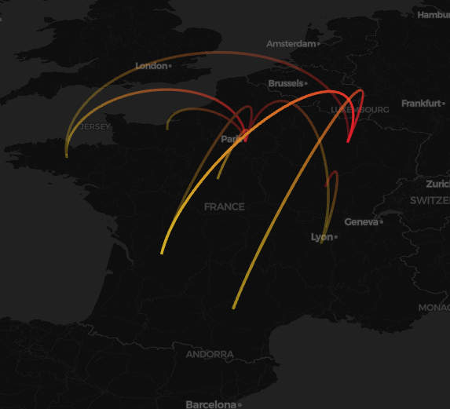


# vizcovidfr
## A python package to visualize spatial evolution of Covid19 cases in France

[comment]: <> 

[comment]: <> 
[comment]: <> 

As part of our course [HMMA238](https://github.com/bcharlier/HMMA238) 'Software Development', we are working on a team project.

### Project description

The goal of our project is to analyze the spreading of the covid19 disease in France.
The main idea is to provide a python package for Covid data visualization.
The package would contain several sub-modules, each of which containing several functions for specific visualization purpose. One should be able to use these by passing arguments corresponding to the desired output. We want our package to be easy to use and plan on building a clear and detailed documentation.
Hopefully our modules will also provide functions for animated and interactive data visualization.

We use Covid-related [datasets available on data.gouv.fr](https://www.data.gouv.fr/en/datasets/).

### Members

- Foux Quentin, quentin.foux@etu.umontpellier.fr
- Llinares Laurent, laurent.llinares@etu.umontpellier.fr
- Nicolas Alexandre, alexandre.nicolas@etu.umontpellier.fr
- Vernay Amelie, amelie.vernay@etu.umontpellier.fr

### Roles

- Foux Quentin: line charts or/and other useful charts which would be relevant to desired variables
- Llinares Laurent: line charts, bar plots and heatmap
- Nicolas Alexandre: histograms / bar chart / visualization
- Vernay Amelie: maps

- Everyone: module architecture, documentation, unit tests...
