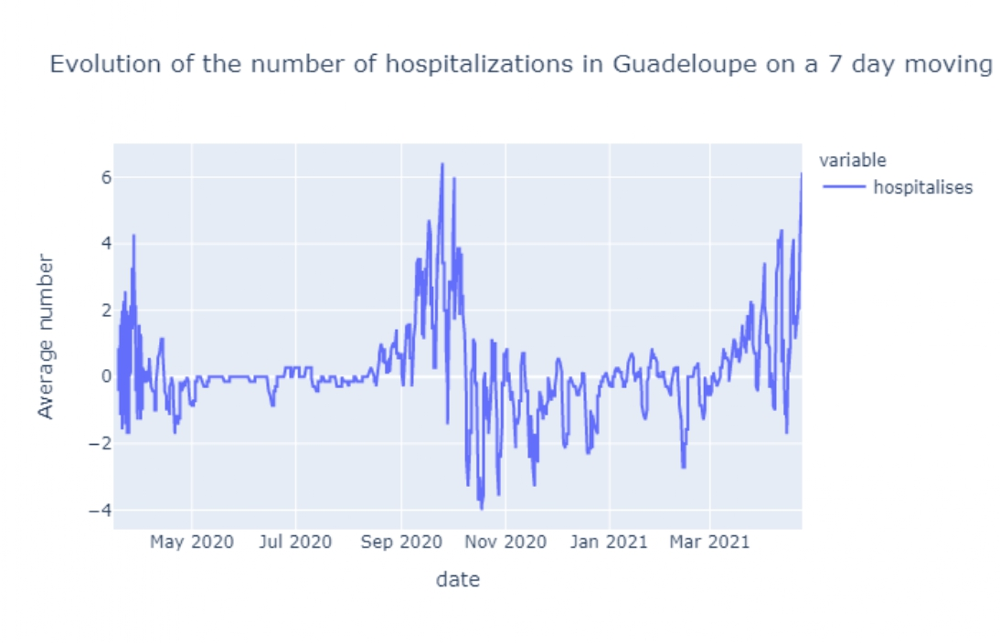
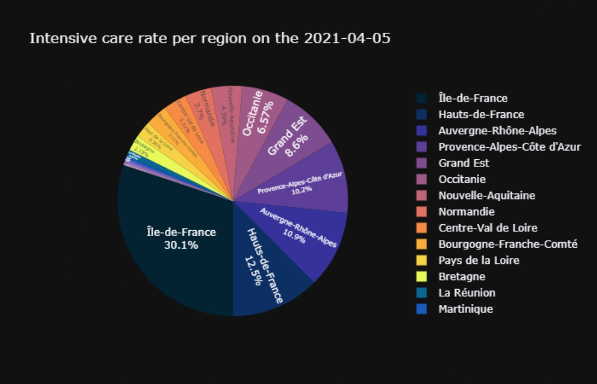
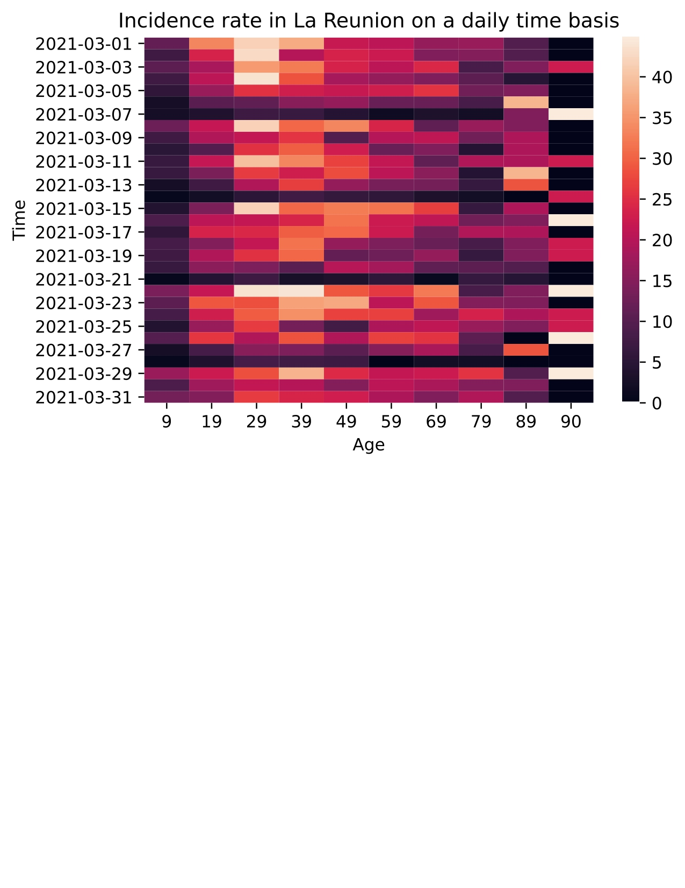

```{r setup, include=FALSE}
knitr::opts_chunk$set(echo = FALSE)
```

## Our goals

- Analyze the spreading of the Covid-19 disease in France.
\pause
- Produce various charts to illustrate how the Covid-19 affects population.
\pause
- Predict how the Covid-19 will evolve in the future.
\pause
- Create a simple visualization tool as interactive as possible and easy to use for anyone.

## Data (part 1/3)

- All the datasets that we used are taken from <https://www.data.gouv.fr/fr/pages/donnees-coronavirus>.
\pause
- Data is collected almost every day per region / department for different variables such as hospitalization or death for example.
\pause
- Here is a summary table of every dataset used.
\pause

## Data (part 2/3)

| dataset                               | desciption                                                         |
|:-------------------------------------:|:------------------------------------------------------------------:|
|`chiffres-cles`                        | hospitalization, intensive care, death, by regions and departments |
|`chiffres-fr`                          | cases, hospitalization, intensive care, death for the whole France |
|`classe_age`                           | hospitalization, intensive care, death, by age range and region    |
|`covid-19-france-vaccinations-age-dep` | vaccine administration by age                                      |
|`stocks-es-national`                   | vaccine type in storage                                            |
|`transfer.csv`                         | patient transfers                                                  |

## Data (part 3/3)

| dataset                               | desciption                                                        |
|:-------------------------------------:|:-----------------------------------------------------------------:|
|`posquotreg`                           | positivity and tests by sex and age for regions (daily)           |
|`posquotfr`                            | positivity and tests by sex and age for the whole France (daily)  |
|`poshebreg`                            | positivity and tests by sex and age for regions (weekly)          |    
|`poshebfr`                             | positivity and tests by sex and age for the whole France (weekly) |
|`incquotreg`                           | incidence rate by sex and age for regions                         |
|`incquotfr`                            | incidence rate by sex and age for the whole France                |

## Module structure (part 1/3)

```
vizcovidfr
|   .github/workflows
|   beamer
|   doc
│   report
|   vizcovidfr
|   .gitignore
|   README.md
|   requirements.txt
└── setup.py
```

## Module structure (part 2/3)

```
vizcovidfr
|   ...
│
└───vizcovidfr
│   │   barplots
│   │   data
|   |   heatmap
|   |   line_charts
|   |   loads
|   |   maps
|   |   pie_charts
|   |   prediction
|   |   preprocesses
|   |   regression
|   |   sparse
|   |   tests
|   |   README.md
|   └── __init__.py
│
└───...
```

##  Module structure (part 3/3)

```
vizcovidfr
|   ...
│
└───vizcovidfr
│   │   ...
|   |
│   └───tests
│       │   __init__.py
│       └── test_vizcovidfr.py
|
│
└───...
```

## `test_vizcovidfr.py`

```
def test_viz3Dmap():
    """
    Test viz3Dmap by running the function.
    If something fails while running it, result won't be defined,
    and an AssertionError will raise.
    ---
    Functions/methods that will be tested by extension:
        - load_datasets.Load_chiffres_cles().save_as_df()
        - preprocess_chiffres_cles.drop_some_columns()
        - preprocess_chiffres_cles.reg_depts()
        - preprocess_chiffres_cles.reg_depts_code_format()
        - preprocess_maps.map_save_path_routine()
    """
    result = (type(maps.viz3Dmap(file_path='')) != int)
    assert
```

## Essai Amélie 01:32


## essais Amélie 01:39 :/

```{r pressure1, echo=FALSE, fig.cap="A caption", out.width = '100%'}
knitr::include_graphics("scatter_hospitalization_Île-de-France.pdf")
```

## essais Amélie 01:42 :(

<object data="scatter_hospitalization_Île-de-France.pdf" width="700px" height="700px"></object>

## essais Amélie 01:45 :'(

```{r, out.width="0.3\\linewidth", include=TRUE, fig.align="center", fig.cap=c("your caption"), echo=FALSE}
knitr::include_graphics("scatter_hospitalization_Île-de-France.pdf")
```

## Essais Amélie 01:49 x@

```{r pressure, echo=FALSE, fig.cap="A caption", out.width = '100%'}
knitr::include_graphics("scatter_hospitalization_Île-de-France.jpg")
```

## Conclusion Amélie 01:51 :D

J'ai cas tout convertir en .jpg !

## Workflow

- Each contributor created a class to load the dataset he used.
\pause
- Each contributor put as many functions as possible in preprocess to have a clear code, which allowed others to use them.
\pause
- Each contributor worked on his branch to avoid conflicts.
\pause
- Each contributor created his own modules, with its documentation and their unit tests associated.

## Regression and prediction (part 1/6)

- Because we had data relative to the time, we wanted to predict the evolution of Covid-19.
\pause
Here is an example of scatter plot
\pause
```{r scat, echo=FALSE, fig.align="center", out.width = '80%'}
knitr::include_graphics("scatter_hospitalization_Île-de-France.jpg")
```

## Regression and prediction (part 2/6)

Linear regression is not adapted to data. \pause How to make prediction then ? \pause
$\implies$ Polynomial regression

Pros and cons :

- Curve predicted follows well the data.
\pause
- Regression has a good R2 (lots of models have more than $90 \%$).
\pause
- Good prediction of foreseeable future.
\pause
- Problem : impossible to predict in a far future

## Regression and prediction (part 3/6)

```{r reg_hosp, echo=FALSE, fig.align="center", out.width = '100%'}
knitr::include_graphics("regression_hospitalization_Île-de-France.jpg")
```

## Regression and prediction (part 4/6)

 Prediction for 2021-04-30 (with data until 2021-04-23) :
 
```{r predict_hosp, echo=FALSE, fig.align="center", out.width = '80%'}
knitr::include_graphics("predict_hospitalization_Île-de-France_2021-04-30.jpg")
```

## Regression and prediction (part 5/6)

Prediction for 2021-06-30 (with data until 2021-04-23) :

```{r predict_hosp_IDF, echo=FALSE, fig.align="center", out.width = '80%'}
knitr::include_graphics("predict_hospitalization_Île-de-France_2021-06-30.jpg")
```

## Regression and prediction (part 6/6)

Advice :

- Use first poly_fit function to see how the model fits with data.
\pause
- Then use predict_curve to check if the predicted curve is going to infinite or not.
\pause
- If predicted curve looks good, then use predict_value to get the value you were looking for.

## Time and memory

- Each function displays its execution time and they're all calculated on the same machine.
\pause
- Proportionality between dataset size and execution time (the bigger the dataset is, the longer it will be loaded).
\pause

## Conclusion / Doorway / Examples 

- Watch the documentation to get thorough information about vizcovidfr's functions.
\pause
- Here are some examples taken from our notebook (in 'report') to inspire you ! 
\pause

```{r line_chart_hosp, echo=FALSE, fig.align="center", out.width = '80%'}

```


## Conclusion / Doorway / Examples 

```{r pie_chart, echo=FALSE, fig.align="center", out.width = '100%'}

```


## Conclusion / Doorway / Examples 

```{r heatmap, echo=FALSE, fig.align="center", out.width = '100%'}

```

## Conclusion / Doorway / Examples 

SPARSE