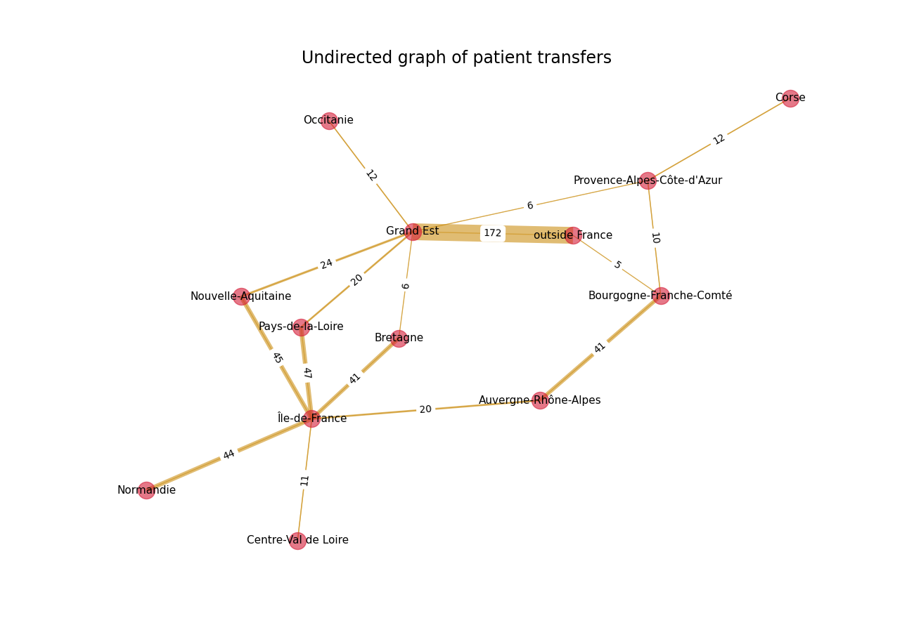

Which way did they go?
======================

The undirected graph
---------------------
You can use the following commands to first plot the undirected graph
of patient transfers.

.. code-block:: python

    from vizcovidfr.sparse import sparse
    sparse.sparse_graph(directed=False)

+--------------+
|              |
|  |undirect|  |
|              |
+--------------+

Do you remember which way did the patient go?
You can figure it out with the next part

The directed graph
-------------------

Now you can use the following commands to plot the directed graph
of patient transfers.

.. code-block:: python

    sparse.sparse_graph(directed=True)

+--------------+
|              |
|  |directed|  |
|              |
+--------------+

.. |directed| image:: directedsparse.png
