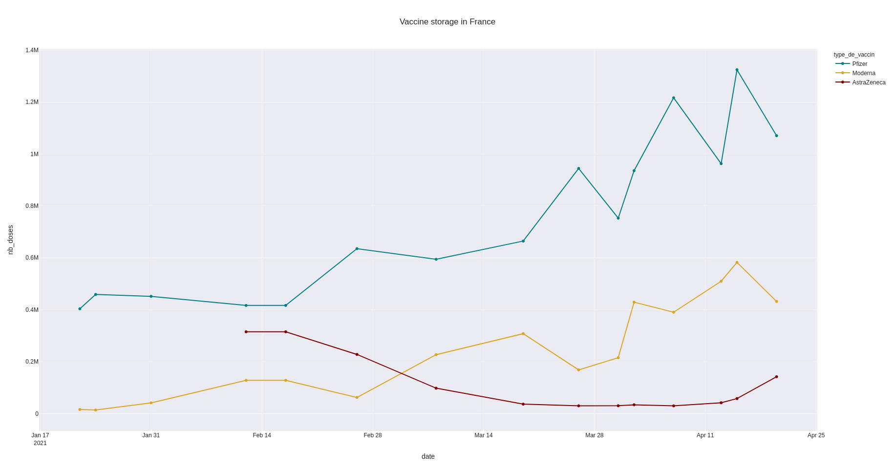

What about vaccines?
====================

Vaccine types
-------------
The commands below allow you to learn more about the evolution of
the number of vaccine doses in stock per type, through time.
The resulting graph is interactive:
-you can pass your mouse on the lines to get more information
-you can select the lines you want to keep by clicking on the legend
-you can zoom on a time zone by clicking and hovering your mouse on it.
You can then go back to default view by double-clicking anywhere.

.. code-block:: python

    from vizcovidfr.line_charts import line_charts
    line_charts.vactypedoses(vaccine_type='All vaccines', color_pal='teal',
                             color_pal2='goldenrod', color_pal3='maroon',
                             font_size=16, font_family='Franklin Gothic Medium',
                             font_color='black', bgcolor='bisque',
                             template='seaborn')

**NB** The graph below is just a static image, and therefore, is *not*
interactive.
You can simply copy-paste the code block above to generate the interactive
version. It should work or your side.

+--------------+
|              |
|  |vaccines|  |
|              |
+--------------+

